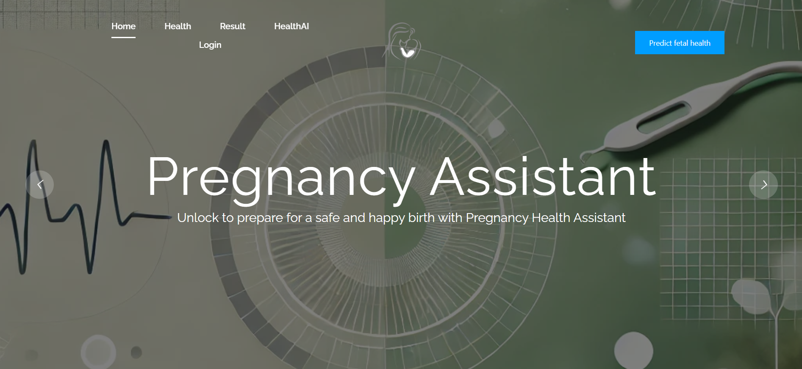
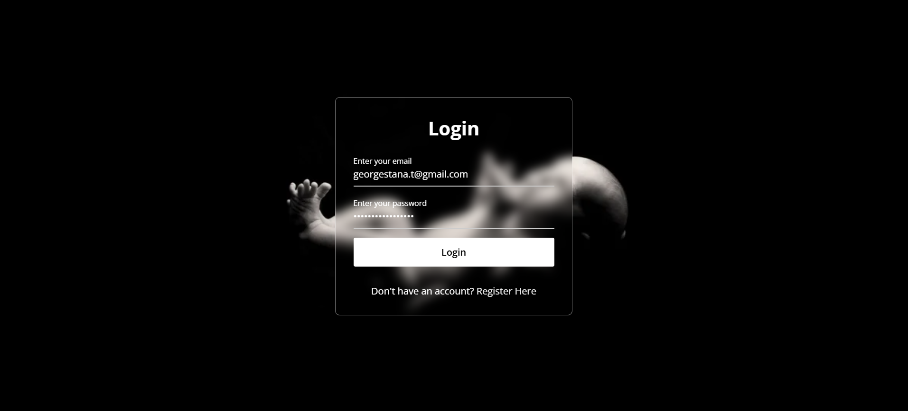
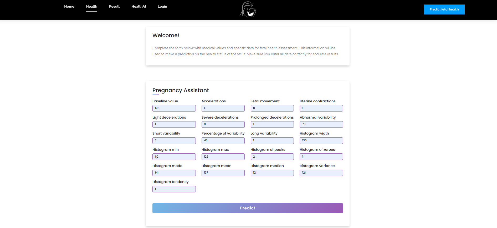
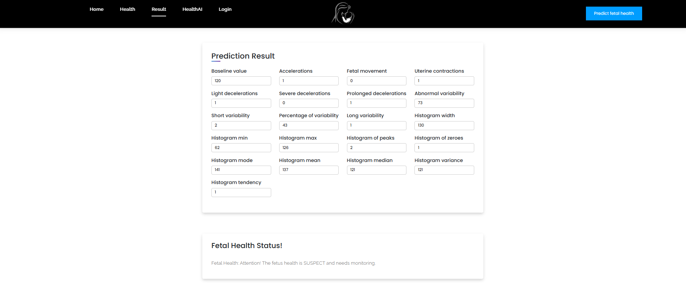
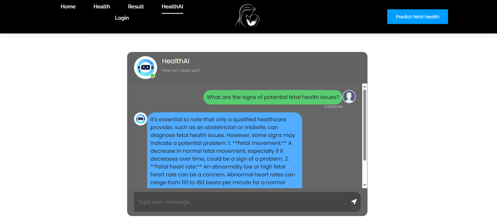

<p align="center">
  
</p>
<p align="center"><b style="font-size: 21px; font-family: 'Times New Roman', serif;">Support for You and Your Baby</b><p>

---

## Table of Contents
- [About](#-about)
- [How to Build](#-how-to-build)
- [Key Features](#-key-features)
- [Contributors](#%EF%B8%8F-contributors)

---

## 🔬 About

**The Pregnancy Health Assistant** is a web application that uses a chatbot and Machine Learning prediction to provide advice based on investigative medical data
(Campos, D. & Bernardes, J. (2000). UCI Machine Learning Repository. https://doi.org/10.24432/C51S4N).

The data is analyzed using an **AI model (Ollama 3.2)** and **Gradient Boosting algorithm** to deliver a preliminary diagnosis of fetal health risks.

Built with **Python** and **Flask**, the application allows users to interact with the chatbot and test functionalities after launching the app.
The core feature is the health prediction, which is generated from the user’s input through the trained machine learning model.

<p align="center">
  
</p>

---

## ⚙️ How to Build

To install the application, follow these steps:

1. **Clone this repository:**
```bash
   git clone https://github.com/Constantin-Stamate/PregnancyHealthAssistant.git
```

2. **Navigate to the project repository:**
```bash
   cd path to directory/PregnancyHealthAssistant
```

3. **Create a virtual environment:**
```bash
   python3 -m venv venv
```

4. **Activate the virtual environment for Windows:**
```bash
   venv/Scripts/activate.bat --activate virtual env
```

5. **Activate the virtual environment for Mac:**
```bash
   source venv/bin/activate
```

6. **Install the dependecies:**
```bash
   pip install -r requirements.txt
```

7. **Additionally, you can connect to a mySQL database and create a project:**
```bash
   app.config['SQLALCHEMY_DATABASE_URI'] = 'mysql+pymysql://<username>:<password>@<hostname>:<port>/<database_name>'
```

8. **Replace flask key with your personal one:**
```bash
   app.secret_key = "your_secure_secret_key"
```

9. **Setup the chatBot:**
```bash
   https://ollama.com/download
```

10. **Run the following command in the terminal:**
```bash
   ollama run llama3.2
```

11. **Run the application:**
```bash
   python app.py
```

12. **Navigate to the following URL in your browser and use the app:**
```bash
   http://127.0.0.1:5000
```

---

## 🧬 Key Features

1. **User Authentication**  
Register and Login functionality for users: Users can create an account and log in to access personalized features.

<p align="center">
  
</p>

2. **Fetal Health Prediction**  
Users can input relevant medical data (such as fetal heart rate, uterine contractions, and more) required for health risk prediction. This data is then processed by the Gradient Boosting model.

<p align="center">
  
</p>

3. **Prediction Results**  
Users can view the medical data they have entered, such as fetal heart rate, uterine contractions, and other relevant health parameters.
The application provides feedback on the fetus's health status, offering a preliminary diagnosis and recommendations to highlight potential risks, aiding healthcare professionals in decision-making.

<p align="center">
  
</p>

4. **HealthAI Chatbot**  
HealthAI chatbot allows users to ask questions about fetal and maternal health, providing answers based on medical data and predictive models. It helps users with health-related queries and offers guidance on maintaining a healthy pregnancy.

<p align="center">
  
</p>

---

## 👩‍💻 Contributors

For more details about our project or any general information, feel free to reach out to us.

<a href="https://github.com/Alexandra-Paula"></a> 
<a href="https://github.com/Andrei-Chiosa"></a>
<a href="https://github.com/Constantin-Stamate"></a>